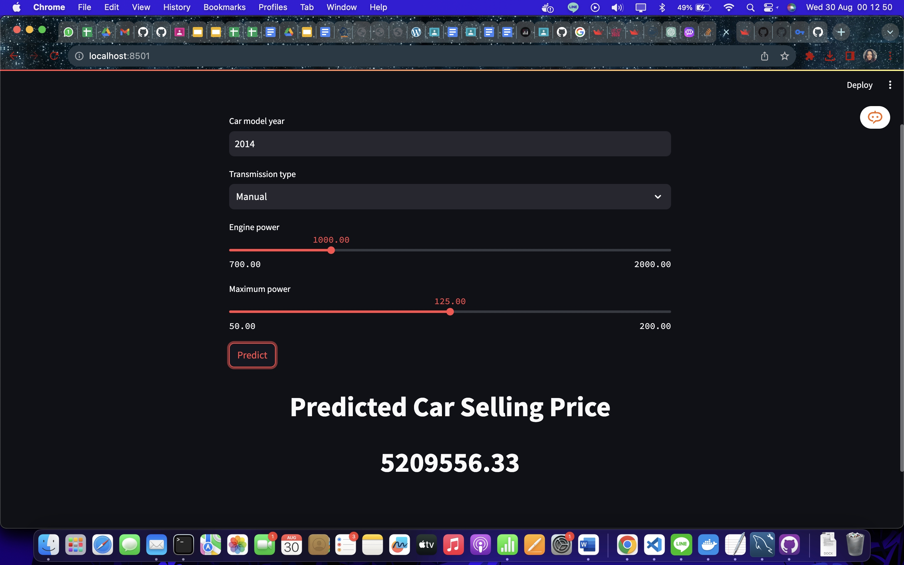

# ML-Projects
To run the app:
1. Go to the app directory.
2. Build the docker image:
    - docker build -t streamlit-app .
3. Run the docker container:
    - docker run -itd -p 8501:8501 -v .:/app streamlit-app
4. Execute the main.py by going inside the docker container
    - docker exec -it <container_name> bash
    - streamlit run main.py
  
The above program will give the following output 

